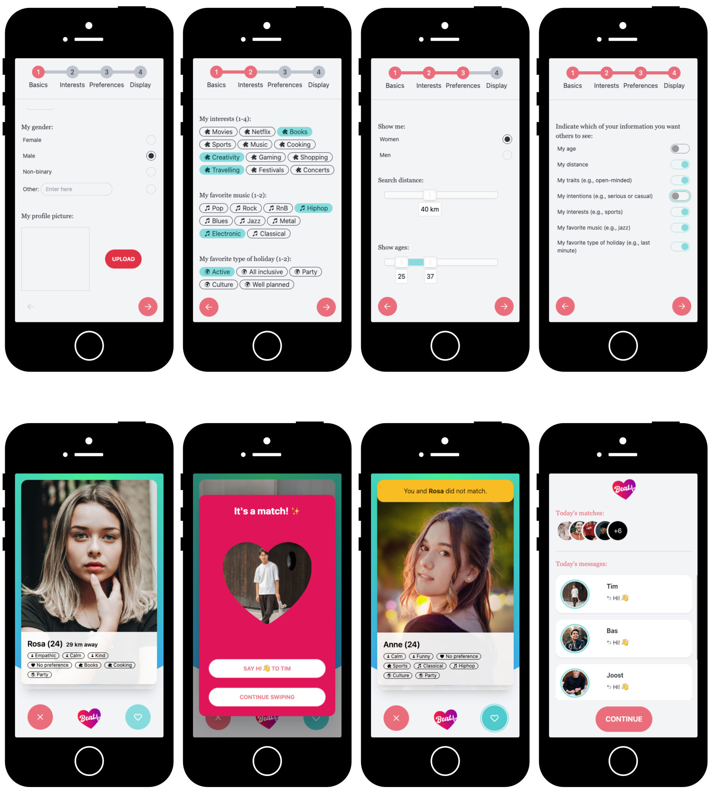

# Heartbeat: Prototype online dating app
This prototype was created to enable researchers to conduct online dating studies in a naturalistic setting (resembling an actual app in look and feel) while maintaining a strong degree of control (fake profiles). It allows for collecting behavioral data (e.g., number of likes) and self-report data (e.g., wellbeing) over time. We used this to collect data across five days, with one interaction per day where participants were presented with 30 profiles per day.

## Getting started
### Importing the database structure
In the **db** folder within this repository there is the **db.sql** file which can be used to create the structure for the database.

### Uploading the files and connecting to the database
1. Upload the **api** and **client** folders to a webserver that is running PHP and MySQL (MySQL at least on the server where the API is running). We would recommend uploading both to the same webserver and having the **api** folder as a root folder on the webserver, as there are several calls to the API address (which is assumed to be at /api/) throughout the Javascript files in the client --- this should be tidied up in a future version.
2. In the file **api/db.php**, make sure the right database connection information is set so that the API can connect to your database.
3. If not running API and client on the same server: check the Javascript files in the client to update all references to the API.

Note that the prototype currently won't run without setting up the database (it crashes after creating a profile).

### Adding profile images
In this repository we did not include any of the profile images we used. The prototype is tested with images that are 900x1350 in size (10:15). These should be uploaded in the **client/img/0/** (female) and **client/img/1/** (male) folders. The filenames should range from 0.jpg to 150.jpg (in our case, for 5 days: 30 pictures per day, so 1--30 for day one, 31--40 for day two, and so on).

## Running the prototype
Running the prototype is a simple matter of referring participants to the /client/ address. The experimental condition can be set by adding the URL parameter **c**. In addition, we integrated our prototype in the Qualtrics survey environment, and as such it is also possible to add the parameter **q** to add the Qualtrics participant ID to the database (in table **participant**). This allows researchers to merge the behavioral data from the prototype with other (demographical, selfreported) data in Qualtrics. An example could be (if running locally):

http://localhost/client/?c=1&q=abcdefg

The **condition** relates to receiving many likes in return after liking a profile (80% chance, and guaranteed on the first like) or few likes in return (20% chance, and definitely not reciprocated on the first like). We implemented this to see if getting many or few likes has an effect on the user's wellbeing. See the **swipe.js** file for the implementation of this condition. The default value is 0 (few matches; 1 = many matches).

## Making further (visual) modifications
Modifying the code is generally a matter of finding the right file and making changes there. The relevant files and their purposes are as follows:
1. index.html / main.js: Checks for a stored cookie (for repeated interactions across multiple days) and sends the user to the correct phase of the interaction (edit this to remove certain steps in the workflow, such as the evaluation or changing the display of personal data after swiping);
2. profile.html / profile.js: Own profile creation. This screen is only activated on first-time use, and allows the user to create their own (fake) profile. These data are not stored, but they help maintain the illusion that something is at stake.
3. swipe.html / swipe.js: The actual swiping of profiles. Edit these files to change the profile names, as well as the interests that are shown on the profiles, and how many of them are shown (which are currently randomized).
4. evaluate.html / evaluate.js: The self-report question on wellbeing shown after swiping, and the ability to change personal information sharing (does not actually do anything other than store the selected pieces of information).

Note that Tailwind CSS and DaisyUI are used to style the prototype. If you make any changes to the style (e.g., by changing the classes), make sure Tailwind CSS is installed (see their website for more information) and the build process is running:

    npx tailwindcss -i ./css/in.css -o ./css/style.css --watch